# Board report extraction plan

## 1. Goal

Build a production-oriented tool that retrieves an official annual-report PDF from Bronnoysundregistrene and extracts only the board report (`styrets arsberetning` / `styrets beretning`) as faithful, source-traceable text.

The tool must not summarize, invent, or enrich the report. It must either:

- return a boundary-verified board report;
- return `NOT_FOUND` when no board report can be identified;
- return `MANUAL_REVIEW` when the section is plausible but its boundaries or text quality are unsafe; or
- return a specific failure status when the source document cannot be processed.

For the MVP, "extract" means loss-minimized text plus structural and source metadata. Producing a new PDF containing only the selected pages is optional and must not be treated as proof that the text boundaries are correct, because the board report can begin or end in the middle of a page.

## 2. Non-goals

- Do not extract financial statements, notes, the auditor's report, or other annual-report sections into the board-report result.
- Do not summarize or interpret board-report content.
- Do not infer a missing report from other sources.
- Do not accept arbitrary remote PDF URLs in the production API.
- Do not replace the existing financial-statement extraction pipeline.
- Do not publish low-confidence OCR text automatically.
- Do not use mock providers, seed records, or synthetic company data.

## 3. Current repository baseline

The project already has most of the lower-level PDF pipeline needed:

- `BrregFinancialsProvider` discovers filed years and downloads official PDFs.
- `preflightAnnualReportDocument` extracts positioned text and assesses text-layer reliability.
- `section-segmentation.ts` recognizes `BOARD_REPORT` and other annual-report sections.
- `unified-parser-document-model.ts` normalizes output from text-layer, OCR, and OpenDataLoader routes.
- `unified-narrative-extractor.ts` can emit a `BOARD_REPORT` narrative, but it is currently shadow-oriented and section-kind deduplication is broader than this tool needs.
- `AnnualReportArtifact` stores immutable artifacts by filing, artifact type, and checksum.
- `AnnualReportNarrative` can expose narrative text to the company UI, but current replacement writes do not preserve an immutable history of board-report extraction attempts.
- `PdfTrainingLabelType.BOARD_REPORT_TEXT` already exists and can support reviewed labels.

The implementation should extend this pipeline rather than add a separate PDF parser.

## 4. Source and input contract

### 4.1 Source of truth

Use only Bronnoysundregistrene's official annual-report-copy API:

- list available years for an organization number;
- download the filed annual-report PDF for an organization number and year.

The official API currently exposes copies for the latest 15 years. The provider remains responsible for retries, response validation, caching, and source metadata.

### 4.2 Supported inputs

Production entry points should accept one of:

1. `filingId`, for a previously discovered `AnnualReportFiling`; or
2. `orgNumber` and `fiscalYear`, resolved through `BrregFinancialsProvider` and the existing filing repository.

A local PDF path may be supported by a development-only CLI. The production service must not fetch a caller-supplied URL, which avoids SSRF and preserves the official-source guarantee.

Validate:

- organization number format and checksum using the project's shared validator;
- fiscal year as a plausible integer and one of the years returned by Brreg;
- PDF magic bytes, content type, maximum byte size, and maximum page count;
- document checksum before processing;
- filing/company/year consistency before persistence.

## 5. Output contract

Introduce a versioned `BoardReportExtractionResult` contract:

```ts
type BoardReportExtractionStatus =
  | "EXTRACTED"
  | "NOT_FOUND"
  | "MANUAL_REVIEW"
  | "UNREADABLE"
  | "SOURCE_UNAVAILABLE"
  | "FAILED";

type BoardReportExtractionResult = {
  version: "board-report-extraction-v1";
  status: BoardReportExtractionStatus;
  filingId: string;
  orgNumber: string;
  fiscalYear: number;
  text: string | null;
  normalizedText: string | null;
  title: string | null;
  pageStart: number | null;
  pageEnd: number | null;
  startBoundary: TextBoundary | null;
  endBoundary: TextBoundary | null;
  includedBlocks: SourceBlockRef[];
  confidence: number;
  quality: {
    startBoundaryConfidence: number;
    endBoundaryConfidence: number;
    textQualityConfidence: number;
    contaminationRisk: number;
  };
  matchedStartSignals: DetectionSignal[];
  matchedStopSignals: DetectionSignal[];
  warnings: BoardReportWarning[];
  route: "TEXT_LAYER" | "OPENDATALOADER_LOCAL" | "OPENDATALOADER_HYBRID" | "OCR";
  extractorVersion: string;
  sourceSystem: "BRREG";
  sourceEntityType: "ANNUAL_REPORT_PDF";
  sourceId: string;
  sourceUrl: string;
  sourceDocumentHash: string;
  fetchedAt: string;
  normalizedAt: string;
};
```

`TextBoundary` must identify page number, block/line identity, and character offset. Page ranges alone are insufficient because a start or stop heading may occur mid-page.

The result must retain original text as the canonical display value. `normalizedText` is only for matching, deduplication, and evaluation.

## 6. Proposed architecture

```mermaid
flowchart LR
    A["Filing ID or org number + year"] --> B["BrregCompany/Financials provider"]
    B --> C["Validated PDF artifact + checksum"]
    C --> D["Preflight and route decision"]
    D --> E["Unified positioned document"]
    E --> F["Board-report boundary detector"]
    F --> G["Text assembler and cleanup"]
    G --> H["Quality and contamination gate"]
    H -->|"high confidence"| I["Immutable extraction result"]
    H -->|"ambiguous"| J["Manual review queue"]
    I --> K["Published BOARD_REPORT narrative"]
    J -->|"accepted/corrected"| K
```



Keep the layers explicit:

1. Provider: official PDF discovery/download.
2. Parser adapters: text layer, OpenDataLoader, and OCR.
3. Unified document model: pages, blocks, coordinates, reading order, and provenance.
4. Board-report detector: start/stop boundaries and evidence.
5. Normalizer/assembler: safe text cleanup without semantic rewriting.
6. Quality gate: publish, abstain, or review.
7. Persistence/service/API: immutable runs, current accepted result, and artifacts.
8. UI: honest available/review/unavailable states.

## 7. Extraction algorithm

### 7.1 Preflight and parser routing

Reuse `preflightAnnualReportDocument` and the existing parser-route machinery.

- Use the positioned text layer when the relevant pages are reliable.
- Use OpenDataLoader local for documents whose text exists but layout or reading order is weak.
- Use the existing hybrid/OCR route for image-only or mixed PDFs.
- Mixed documents must be assessed per page. A reliable cover and financial section must not hide scanned board-report pages.
- Persist the selected route and all route warnings.
- Never silently fall back to an untraceable third-party extraction service.

The router may perform a low-cost full-document pass to locate candidate pages, followed by higher-quality OCR only for the candidate window plus adjacent pages. If the cheap pass cannot locate a safe window, route the whole document to review instead of guessing.

### 7.2 Canonical page/block representation

Before section detection, normalize every parser route into the existing unified document model:

- stable page numbers;
- text blocks and lines with bounding boxes;
- deterministic reading order, including multi-column pages;
- source parser and parser version;
- raw text and matching-normalized text;
- OCR confidence where available;
- block IDs that survive through extraction artifacts.

Do not run the detector directly against raw external parser responses.

### 7.3 Start-boundary detection

Detect a board-report start using weighted evidence, not a single substring.

Strong heading variants should include normalized Norwegian and common English forms:

- `styrets arsberetning`;
- `styrets beretning`;
- `arsberetning`;
- `beretning fra styret` / `styrets redegjorelse`;
- `board of directors' report` / `directors' report`.

Supporting body signals include `virksomhetens art`, `fortsatt drift`, `arbeidsmiljo`, `ytre miljo`, `likestilling`, `utvikling og resultat`, and `framtidsutsikter`. These signals support a heading; they are not sufficient alone for automatic publication.

Heading evidence should consider:

- heading-sized or bold text when geometry/style is available;
- short standalone line rather than an inline phrase;
- position near the beginning of a page or after a previous top-level section;
- following prose density and board-report subsection signals;
- table-of-contents penalties, such as many section names with page numbers on the same page;
- cross-reference penalties, such as "se styrets arsberetning" in notes or auditor text.

If multiple start candidates exist, score each candidate together with its most plausible stop boundary. Do not simply choose the first keyword hit.

### 7.4 Stop-boundary detection

The board report ends immediately before the next high-confidence top-level section. Stop signals, ordered approximately from strongest to weaker, are:

1. `resultatregnskap`, `oppstilling over totalresultat`, or equivalent financial-statement heading;
2. `balanse`, when it is a standalone top-level heading rather than prose;
3. `kontantstromoppstilling`;
4. `noter til arsregnskapet` / `regnskapsprinsipper` as a top-level heading;
5. `uavhengig revisors beretning` / `revisjonsberetning`;
6. another unambiguous document-level heading.

Boundary selection must operate at block or line level. If `Resultatregnskap` starts halfway down the final page, exclude that heading and everything after it while retaining preceding board-report text.

Signature policy:

- Include a contiguous date/signature block when it clearly closes the board report and occurs before the next top-level section.
- Do not absorb a later signature page solely because it contains `styreleder` or `daglig leder`; those terms also appear in financial-statement signatures.
- Record whether signatures were included and which evidence linked them to the board report.

If no safe stop heading exists, permit end-of-document only when the document contains no contradictory sections and confidence remains high. Otherwise return `MANUAL_REVIEW`.

### 7.5 Candidate-span validation

Reject or review a candidate span when any of these conditions hold:

- no strong start heading;
- two near-equal competing start candidates;
- stop boundary precedes the start;
- implausibly short text, such as a heading with no body;
- implausibly large span relative to document length;
- financial tables dominate the selected content;
- auditor-report phrases appear after a likely auditor heading;
- the span is only a table-of-contents entry;
- OCR confidence is poor at either boundary;
- reading-order ambiguity is unresolved;
- repeated or overlapping OCR/text-layer content remains;
- the extracted organization/year conflicts with the filing metadata when those values are visible.

Use negative/contamination classifiers based on section headings and layout, not on business claims inside the report. A board report can legitimately mention revenue, profit, balance-sheet items, auditors, and going concern.

### 7.6 Text assembly and conservative cleanup

Assemble only included blocks in reading order. Cleanup may:

- normalize line endings;
- remove repeated page headers/footers when the repetition and geometry are proven;
- join words split by a line-ending hyphen only when the join is linguistically and geometrically safe;
- collapse clearly accidental whitespace while retaining paragraphs and headings;
- remove exact duplicate OCR/text-layer overlays.

Cleanup must not rewrite wording, numbers, names, punctuation, or paragraph meaning. Preserve a block-level mapping from every output range back to source page and coordinates.

## 8. Confidence and publication policy

Use separate confidence dimensions rather than one opaque score:

- start-boundary confidence;
- stop-boundary confidence;
- parser/text quality;
- reading-order confidence;
- contamination risk;
- overall confidence derived from the weakest critical dimension.

Proposed initial policy, to be calibrated on the reviewed corpus:

- `EXTRACTED`: both boundaries at least `0.90`, text quality at least `0.90`, contamination risk at most `0.05`, and no blocking warning;
- `MANUAL_REVIEW`: plausible candidate but any publish threshold fails;
- `NOT_FOUND`: no credible start candidate after all eligible parser routes;
- `UNREADABLE`: the source exists but no route produces usable text;
- `SOURCE_UNAVAILABLE`: Brreg has no document for the requested year;
- `FAILED`: unexpected processing failure with a stable error code.

The system must prefer abstention over a contaminated result. `confidence` must never be displayed as proof of correctness; provenance, warnings, and review status remain visible internally.

## 9. Persistence design

### 9.1 Immutable extraction history

Add a dedicated immutable `BoardReportExtraction` model rather than overwriting the current `AnnualReportNarrative` row on every attempt. Suggested fields:

- identity: `id`, `filingId`, `companyId`, `fiscalYear`, `extractionRunId` where applicable;
- status and review state;
- original and normalized text, title, page range, exact boundaries;
- confidence dimensions, warnings, signals, and included block references as JSON;
- route, extractor version, parser version, OCR engine/version/language;
- all required source fields: `sourceSystem`, `sourceEntityType`, `sourceId`, `fetchedAt`, `normalizedAt`;
- source URL, source document hash, result text checksum;
- `createdAt`, and reviewer/correction linkage when manually resolved.

Add indexes on `(companyId, fiscalYear, status)`, `(filingId, createdAt)`, and `(sourceDocumentHash, extractorVersion)` for idempotency and audit lookup.

### 9.2 Artifacts

Extend `AnnualReportArtifactType` with:

- `BOARD_REPORT_EXTRACTION_JSON`: complete versioned result and diagnostics;
- `BOARD_REPORT_TEXT`: exact accepted text, if a separate text artifact is operationally useful;
- optionally `BOARD_REPORT_REVIEW_PDF`: rendered start/end pages with boundary overlays for reviewers.

Artifacts must use the existing checksum-based storage abstraction. Do not store intermediate files outside the configured artifact store except under `tmp/pdfs/`, and remove temporary files after completion.

### 9.3 Publishing to existing narrative UI

Treat `AnnualReportNarrative(sectionKind = BOARD_REPORT)` as the current accepted projection, not the extraction history.

- Project automatically only from `EXTRACTED` results that pass the publish gate.
- Project from a manually accepted/corrected result after review.
- Never publish `MANUAL_REVIEW`, `NOT_FOUND`, or failed results.
- Keep the accepted extraction ID in the projection so the displayed text is traceable.
- Update repository writes so an empty result can clear or supersede a stale projection intentionally; the existing early return on an empty list must not leave stale data.

## 10. Service, CLI, and API

### 10.1 Core service

Create a narrow service such as `BoardReportExtractionService` with these operations:

- `extractForFiling(filingId, options)`;
- `extractForCompanyYear(orgNumber, fiscalYear, options)`;
- `getLatestAccepted(companyId, fiscalYear)`;
- `submitReview(extractionId, decision, correctedBoundaries?)`.

The service owns idempotency, artifact lookup, parser routing, quality gating, and persistence. The pure detector remains dependency-free and unit-testable.

### 10.2 CLI

Add an operator CLI:

```text
npm run financials:extract-board-report -- --org-number=<9 digits> --year=<yyyy>
npm run financials:extract-board-report -- --filing-id=<id> --json
```

Useful flags:

- `--force` to rerun the same document/version;
- `--no-persist` for diagnosis;
- `--route=<route>` for controlled experiments, not normal production use;
- `--render-review` to generate boundary-review images/PDF;
- `--json` for machine-readable output.

Default terminal output should report status, page/block boundaries, route, confidence dimensions, warnings, artifact IDs, and no full report text unless `--json` or an explicit output flag is used.

### 10.3 Internal API

If interactive extraction is required, add authenticated internal endpoints rather than a public arbitrary-PDF endpoint:

- `POST /api/internal/annual-report-board-reports/extractions`;
- `GET /api/internal/annual-report-board-reports/extractions/:id`;
- `POST /api/internal/annual-report-board-reports/extractions/:id/review`.

Validate requests with Zod, apply admin/workspace authorization, rate limits, idempotency keys, request timeouts, and stable error responses. Prefer background job execution for OCR-heavy documents.

## 11. Manual review workflow

Review is required for ambiguous boundaries and low-quality OCR.

The review screen should show:

- rendered start and end pages;
- highlighted included blocks and excluded stop heading;
- extracted text with page markers;
- start/stop signals, confidence dimensions, warnings, route, and source link;
- actions: accept, adjust boundaries, reject as not found, request reprocessing;
- reviewer identity, timestamp, decision reason, and immutable before/after result.

Use `BOARD_REPORT_TEXT` labels for accepted text spans and retain block/page boundaries. Corrections should produce a new reviewed result linked to the machine proposal; they must not mutate the original extraction artifact.

## 12. Testing and evaluation

### 12.1 Unit tests

Test pure logic with minimal, clearly non-production parser fragments:

- all supported start-heading variants and diacritics;
- heading on a page following a table of contents;
- inline cross-reference that must not start a section;
- same-page start and stop boundaries;
- multi-page continuation without repeated headings;
- financial statement, notes, and auditor stop headings;
- signature inclusion and false signature-page exclusion;
- multi-column ordering;
- repeated headers/footers;
- OCR substitutions and broken words;
- duplicate text-layer/OCR overlays;
- multiple competing board-report candidates;
- empty, encrypted, malformed, oversized, and image-only documents;
- deterministic IDs and output for identical inputs.

### 12.2 Real-document gold set

Build a reviewed corpus exclusively from official Brreg PDFs already obtained through the provider. Do not hardcode company identities into application logic.

Stratify selection by:

- fiscal year and document age;
- digital text, scanned, and mixed documents;
- one-column, multi-column, and designed annual reports;
- short and long board reports;
- Norwegian Bokmal, Nynorsk, and English where available;
- board report before/after statements;
- same-page and separate-page boundaries;
- documents with and without a board report;
- duplicate/revised filings and difficult OCR.

Store labels, hashes, source IDs, and review provenance. Keep source PDFs in controlled artifact storage rather than committing company documents to Git. Render labeled boundary pages and inspect them visually, as text extraction alone cannot validate layout fidelity.

Start with at least 75 diverse documents for the MVP gate, including at least 20 scanned/mixed documents and 10 negative/no-safe-result cases. Expand the corpus continuously from manual-review outcomes.

### 12.3 Metrics

Measure separately by parser route and document stratum:

- document-level precision/recall for board-report presence;
- exact start-page and end-page accuracy;
- exact block-boundary accuracy;
- normalized character precision, recall, and F1 against reviewed text;
- contamination rate from excluded top-level sections;
- table-of-contents false-positive rate;
- automatic extraction rate versus abstention/review rate;
- OCR character error rate on accepted spans;
- p50/p95 processing duration, memory, and artifact size;
- reproducibility for identical document hash and extractor version.

Proposed launch gates:

- at least `99%` document-level precision on automatically published results;
- zero known auditor-report or full financial-statement contamination in the launch gold set;
- at least `98%` exact page-boundary accuracy for automatically published results;
- at least `0.98` median normalized character F1 for text-layer documents;
- all failures and abstentions carry stable reason codes;
- no regression in the existing financial extraction test suite.

Recall is secondary to precision for automatic publication. OCR results may have a lower automation rate, but not a lower contamination standard.

### 12.4 Regression suite

Add a versioned board-report gold-set runner and package scripts:

- `test:board-report-extraction`;
- `evaluate:board-report-extraction`;
- `check:board-report-regression`;
- `render:board-report-review-pack`.

CI should run fast unit/fixture tests. Real-PDF evaluation can run in a protected integration job with artifact-store access, and promotion should require its signed result artifact.

## 13. Security, privacy, and operational controls

- Fetch only provider-resolved Brreg URLs and validate redirects against an allowlist.
- Enforce byte/page/time/memory limits to mitigate PDF bombs and parser denial of service.
- Treat PDFs and extracted text as untrusted input; never execute embedded actions, JavaScript, attachments, or links.
- Run native/OCR parsers with constrained resources where possible.
- Do not log full report text. Log IDs, hashes, route, status, timings, and bounded error context.
- Preserve official names/signatures only as source content; do not enrich them from unofficial sources.
- Use retention and access rules appropriate for documents containing personal names and signatures.
- Make retries idempotent by document hash plus extractor version.
- Use bounded exponential backoff and respect Brreg response status/headers.

## 14. Observability

Emit structured events for:

- source resolution and download outcome;
- document hash/cache hit;
- preflight quality and chosen parser route;
- candidate count and selected boundary signals;
- extraction status and confidence dimensions;
- contamination-gate failures;
- manual-review creation and resolution;
- artifact persistence and projection publication;
- processing duration and resource usage per stage.

Dashboards should show success, not-found, unreadable, manual-review, and failure rates by route, fiscal year, parser version, and extractor version. Alert on sudden changes in Brreg download failures, OCR routing, contamination warnings, and review backlog.

## 15. Implementation phases

### Phase 0 - Contract and corpus

1. Finalize the output/status contract and the signature inclusion policy.
2. Define immutable provenance and artifact schemas.
3. Select and label the first official-PDF gold set.
4. Record baseline performance of the current `section-segmentation` and unified narrative extractor.

Exit: reviewed labels exist, baseline metrics are reproducible, and no production behavior has changed.

### Phase 1 - Pure boundary detector

1. Add board-specific start/stop signal definitions.
2. Implement block-level candidate generation and table-of-contents/cross-reference penalties.
3. Implement candidate-span validation, contamination detection, and confidence dimensions.
4. Add conservative text assembly with source-range mapping.
5. Add deterministic unit and regression tests.

Likely files:

- new `integrations/brreg/annual-report-financials/board-report-extractor.ts`;
- new matching test file;
- small shared additions to `document-model.ts` or `unified-parser-document-model.ts` only where required.

Exit: the pure extractor meets digital-text gold-set thresholds without persistence or UI changes.

### Phase 2 - Parser routes and artifacts

1. Integrate preflight and unified parser routes.
2. Add selective OCR for candidate/adjacent pages.
3. Persist full extraction JSON and optional review overlays.
4. Add immutable extraction schema/migration and idempotency.
5. Implement the CLI with `--no-persist` and render modes.

Likely files:

- new board-report extraction service and repository;
- Prisma schema and migration;
- `AnnualReportArtifactType` additions;
- artifact storage integration;
- new CLI script and package scripts.

Exit: a filing can be processed end to end from an official stored/downloaded PDF, with traceable artifacts and no narrative publication.

### Phase 3 - Shadow run and calibration

1. Run against a diverse filing batch in shadow mode.
2. Review every proposed automatic result and a sample of `NOT_FOUND` results.
3. Tune thresholds using held-out documents; do not tune against the final gate set.
4. Compare routes and investigate every contamination error.
5. Freeze `board-report-extraction-v1` configuration and regression snapshot.

Exit: launch gates pass on held-out official PDFs and operational cost/latency are understood.

### Phase 4 - Review and controlled publication

1. Add review queue and boundary-adjustment UI.
2. Project only accepted `BOARD_REPORT` results into `AnnualReportNarrative`.
3. Expose honest UI states: available, under review, not found, and unreadable/unavailable.
4. Canary-enable automatic publication for high-confidence text-layer documents.
5. Keep OCR/mixed documents review-only initially.

Exit: canary has no confirmed contamination and every displayed report is traceable to an accepted extraction.

### Phase 5 - Scale and maintenance

1. Expand automation to qualified parser routes based on measured results.
2. Backfill by fiscal year with rate limits, checkpoints, and resumability.
3. Feed review corrections into the gold set.
4. Version all rule/config changes and rerun regression gates before promotion.
5. Document source availability, limitations, and operator recovery in README/runbooks.

Exit: scheduled/backfill processing is observable, recoverable, and remains within quality gates.

## 16. Definition of done

The board-report tool is complete when:

- it accepts a filing ID or organization number/year and resolves only an official Brreg PDF;
- it returns only the board-report text with exact page/block boundaries and complete provenance;
- mid-page boundaries, signatures, table-of-contents hits, scans, and mixed PDFs are handled or explicitly abstained from;
- unsafe results enter manual review and are never silently published;
- immutable extraction records and artifacts preserve every run and correction;
- the accepted result can be projected into the existing company narrative UI;
- all required source traceability fields are present;
- real-document regression and visual-review gates pass;
- CLI/API input validation, resource limits, idempotency, and observability are in place;
- README/runbooks clearly state Brreg's availability limits and the tool's unsupported/unreadable states;
- no mock provider, seed data, hardcoded company, or synthetic business content is introduced.

## 17. First implementation slice

The safest first slice is deliberately narrow:

1. Add a pure `extractBoardReport(unifiedDocument)` function.
2. Return the versioned result in memory with `EXTRACTED`, `NOT_FOUND`, or `MANUAL_REVIEW`.
3. Support reliable text-layer PDFs only.
4. Require strong heading-based start and stop boundaries.
5. Evaluate against visually reviewed official PDFs.
6. Do not persist to `AnnualReportNarrative` yet.

This validates the hardest requirement - clean section boundaries - before adding OCR, persistence, API, UI, or backfill complexity.
