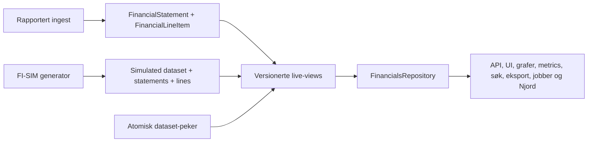

# Implementasjonsplan: isolert FI-SIM-datasett

**Status:** Klar for implementasjon

**Dato:** 6. august 2026

**Styrende dokumenter:** [ADR-0002](../adr/ADR-0002-isolated-simulated-financials-layer.md) og [FI-SIM-2026.1](./fi-sim-2026.1-spec.md)

Planen er en additiv expand-and-contract-migrasjon. Ingen fase skal endre eller slette rapporterte finansdata. Hver fase har en selvstendig verifikasjonsport.

## Implementasjonsstatus 6. august 2026

| Fase | Status | Bevis |
|---|---|---|
| F0 | Delvis | Eksakt reader-register og baseline-gate finnes. Parity-fixtures, artefaktinventar og fjerning av forbudt direkte kildetilgang gjenstår. |
| F1 | Kontraktgrunnlag fullført | Runtime-validert live-kontrakt for IDs, datasetversjon og provenance finnes; eksisterende servicekontrakter migreres i F4. |
| F2 | Fullført | Additive Prisma-modeller, database-constraints, immutability-triggere og verifikasjon i disposable PostgreSQL. |
| F3 | Delvis | Versionerte views og et snapshot-konsistent company-repository finnes. Flere repository-metoder og inkrementering av `reportedRevision` gjenstår. |
| F4–F7 | Ikke startet | Eksisterende runtime-konsumenter er ikke flyttet, og generator/mapping er ikke implementert. |
| F8 | Delvis | DB-aktivering og live-views er fail-closed med capability-rolle, `FJORD_DEPLOYMENT_ENVIRONMENT=investor-demo` og `FJORD_FINANCIAL_SIMULATION_ENABLED=true`. Kontrollert produktkommando, audit-logg og reell runtime-principal gjenstår. |
| F9–F11 | Ikke startet | UI/eksport/Njord, operativ demo og teardown-repetisjon gjenstår. |

Kommandoer for fundamentet:

```text
npm run financials:check-source-access
npm run financials:verify-simulation-foundation
```

Verifikasjonsskriptet nekter å kjøre med mindre databasen heter `fi_sim_migration_test_*`.

`financials:check-source-access` er en baseline-regresjonsport, ikke et bevis på at F4 er ferdig. Den avviser nye eller uregistrerte kildelesere, men rapporterer eksplisitt den eksisterende migrasjonsgjelden. Simulering skal ikke aktiveres før gjelden er null og alle avhengige jobber, cacher og eksporter er inventarisert.

## 1. Nå-situasjon

Den permanente rapporterte kjernen er:

- `FinancialStatement` for normaliserte statements og headline-verdier
- `FinancialLineItem` for source labels, nullable `metricKey` og mapping
- `MetricAlias` og canonical-key-modellen for mapping

`PublishedFinancialLineItem` er en separat, eldre publiseringsflate. Den skal ikke bli kilde for det nye live-viewet. Rapporterte linjer må være normalisert til `FinancialLineItem` før de kan brukes som ankere.

Prisma 6.19.3 brukes i dag. Live-viewet bør opprettes i SQL-migrasjonen og leses gjennom eksplisitte repository-DTO-er og parameterisert SQL. Da er viewet read-only selv om ORM-støtten for views endres.

## 2. Målarkitektur



Kun ingest-, mapping-, simulerings- og migrasjonsjobber kan lese kildetabeller direkte. Runtime-konsumenter bruker `FinancialsRepository`.

## 3. Faseplan

### F0 — Baseline og leserregister

**Leveranser**

- Legg til en maskinlesbar allowlist for moduler som kan bruke finansielle kildemodeller.
- Legg til en CI-kontroll som feiler ved nye direkte runtime-lesere.
- Lag parity-fixtures for dagens rapporterte output fra public financials service.
- Dokumenter hvilke bakgrunnsjobber, cache-nøkler og eksportformater som inneholder finansdata.

**Port**

- Alle aktive lesere i tabellen under er klassifisert.
- Baseline-testene passerer uten schemaendring.

### F1 — Live-kontrakt og proveniens

**Leveranser**

- Innfør delte typer for `FinancialDatasetVersion`, `ValueOrigin` og `StatementOrigin`.
- Gjør normalized statement og line item kildeuavhengige.
- Legg til kildeavgrenset `liveStatementId` og nullable `reportedStatementId`.
- Gjør filing- og dokumentfelt nullable for simulerte statements.
- Krev datasetversjon i alle finansielle service-resultater.

**Port**

- Typecheck beviser at alle forbrukere håndterer provenance.
- En simulert linje kan ikke serialiseres som rapportert ved manglende felt.

### F2 — Additivt skjema

Opprett en ny migrasjon etter den eksisterende, pågående company-map-migrasjonen. Den eksisterende migrasjonen skal ikke endres.

**Nye modeller**

- `SimulatedFinancialDataset`
  - immutable ID, status og versjoner
  - generator-, antakelses-, profil- og taksonomiversjon
  - manifest, opprettet av og valideringsresultat
- `SimulatedFinancialStatement`
  - dataset, company, fiscal year, scope og origin
  - profil, perioder, valuta, enhet og valideringsstatus
- `SimulatedFinancialLine`
  - statement, concept, source label og presentation metadata
  - XOR mellom rapportert line-item-referanse og syntetisk verdi
  - derivation rule og provenance; finansverdien forblir immutable etter validering
- `SimulatedFinancialLineMapping`
  - append-only nullable `metricKey` per linje og mappingrevisjon
- `SimulatedMetricAlias`
  - append-only dataset- og mappingrevisjon, normalisert alias og canonical metric
- `ActiveFinancialDataset`
  - singleton/scope, modus, aktiv simulert dataset-ID, mappingrevisjon og monoton aktiveringsrevisjon
- `FinancialDatasetRevision`
  - monoton revisjon for rapportert ingest og aktivert simulert dataset

**Database-constraints**

- XOR-constraint for ankerreferanse og syntetisk verdi.
- Ingen fremmednøkkel fra rapporterte tabeller til simulerte tabeller.
- Unik statement per dataset, company, year og scope.
- Unik line per statement og concept.
- Aktiv simulert pointer må referere til et validert, immutable dataset.
- Et aktivert dataset kan ikke oppdateres.

**Port**

- Migrasjonen kan rulles frem på en kopi av gjeldende database.
- Eksisterende rapporterte records er byte-likt uendret.
- Constraint-tester avviser ugyldige bindinger og mutable aktiverte datasets.

### F3 — Versionerte live-views og repository

**Leveranser**

- Opprett `live_financial_statements_v1`.
- Opprett `live_financial_line_items_v1`.
- Viewene velger én gren basert på `ActiveFinancialDataset` i samme database-snapshot.
- Rapportert gren leser `FinancialStatement` og `FinancialLineItem`.
- Simulert gren løser rapporterte ankerverdier ved join; den kopierer dem ikke.
- Implementer `FinancialsRepository` med metoder for company, perioder, scope, aggregation og univers-søk.
- Eksponer datasetversjon på hver rad og hvert repository-resultat.

**Datasetversjon**

- Rapportert modus bruker `reported:<reportedRevision>`.
- Simulert modus bruker `simulated:<datasetId>:<activationRevision>`.
- Rapportert ingest øker `reportedRevision` i samme transaksjon som publisering.
- Datasetaktivering øker `activationRevision` i samme transaksjon som pekerbyttet.

**Port**

- Rapportert modus matcher baseline-fixtures.
- Et pekerbytte gir aldri blandede eller tomme resultater under samtidige lesinger.
- Repository-et kan kjøres når simuleringstabellene er tomme.

### F4 — Flytt alle runtime-lesere

Migrer i denne rekkefølgen:

1. offentlig company financials service og company profile
2. watchlist og company-universe/screening
3. distress- og investment-analyser
4. Njord-verktøyene for gruppeestimat og M&A pro forma
5. raw-financials API og eksport
6. presentasjons- og metric-konsumenter
7. bakgrunnsjobber, cache og søkeindekser

Etter hver gruppe kjøres parity-test i rapportert modus før neste gruppe flyttes.

**Port**

- CI-kontrollen finner ingen ikke-tillatt runtime-lesing fra kildemodellene.
- Alle finansielle responses har `financialDatasetVersion`.

### F5 — Mapping-isolasjon

**Leveranser**

- Trekk ut normalisering og matching fra dagens metric-mapping til en delt, ren motor.
- La rapportert mapping fortsette å bruke `MetricAlias` og `FinancialLineItem`.
- La simulert mapping bruke `SimulatedMetricAlias` og `SimulatedFinancialLine`.
- Route mapping-lesing og -skriving etter aktivt datasett og autorisert miljø.
- Hold mapping-orakelet i testdata, utenfor runtime-katalogen.
- Legg inn et eksplisitt manifest over concepts som skal starte umappet i demoen.

**Port**

- En mapping opprettet i simulert modus endrer ingen rapportert alias eller linje.
- Samme input til den delte motoren gir samme kandidatresultat i begge modi.
- Generatoren har aldri skrevet en ikke-null `metricKey` direkte.

### F6 — FI-SIM-katalog og profiler

**Leveranser**

- Implementer `FI-SIM-2026.1` som versjonerte, kodeeide manifests.
- Implementer concepts, labels, definitions, presentation roles og calculation relationships.
- Implementer de seks godkjente profilene.
- Implementer deterministisk profilvalg fra reell SSB-næringskode, organisasjonsform og regulatorisk overlay.
- Blokker bank og forsikring med eksplisitt feilkode.
- Legg til en lint-test som forbyr IFRS-importer, namespaces og forbudte produktpåstander i FI-SIM-laget.

**Port**

- Catalog snapshot er stabil og versjonert.
- Hver profil har både gyldig resultat- og balansetre.
- Ingen profil publiserer alle concepts.

### F7 — Generator og validator

**Leveranser**

- Implementer stabil seed og versjonert antakelseskonfigurasjon.
- Generer inntil fem fullførte år uten perioder før stiftelsesdato.
- Bind rapporterte ankere før noen syntetisk verdi løses.
- Implementer calculation identities, flerårsbro og residualregler.
- Lagre nye datasets i `BUILDING`, valider, og flytt dem til `VALIDATED` uten mutasjon etterpå.
- Kjør generering i en eksplisitt bakgrunnsjobb.

**Port**

- Determinismetester er byte-stabile.
- Property-tester dekker alle profiler, år, scopes og relevante ankerkombinasjoner.
- Rapporterte anchor records har identisk hash før og etter generering.
- Alle publiserbare statements balanserer eksakt.

### F8 — Aktivering, tilgang og versjonskontroll

**Leveranser**

- Legg til tilgangskontrollert feature flag, av som standard.
- Tillat aktivering bare når miljøet eksplisitt er klassifisert som investor-demo.
- Implementer atomisk activate/rollback-kommando med audit-logg.
- Opprett separate database-roller for runtime, reported ingest og simulation jobs.
- Runtime-rollen får bare `SELECT` på live-views og nødvendig datasetmetadata.
- Namespace eller invalider cache, analyser, søkeindekser, eksporter og jobbresultater med datasetversjon.
- Avvis publisering fra en jobb som startet på en inaktiv versjon.

**Port**

- Feature flag av + simulert DB-peker gir fail-closed-adferd.
- Runtime-rollen kan ikke lese noen kildetabell direkte.
- Rollback aktiverer forrige immutable demo-dataset uten kopiering.

### F9 — UI, API, eksport og Njord

**Leveranser**

- Vis vedvarende demo-banner på hybride og simulerte statements.
- Merk hver syntetiske tabellinje.
- Før `statementOrigin` og datasetversjon gjennom grafer og metrics.
- Legg disclaimer og datasetmetadata i eksport.
- La Njord oppgi at et finansielt svar bygger på demo-simulering.
- Avvis kommentar- og evidence-mutasjoner for simulerte statements.
- Ikke vis filing-, dokument- eller innsendingsmetadata for simulerte statements.

**Port**

- E2E-test dekker tabell, graf, metric, eksport og Njord i begge modi.
- Tilgjengelighetstest bekrefter at markering ikke bare kommuniseres med farge.
- API-contract test hindrer syntetisk provenance i å bli serialisert som rapportert.

### F10 — Demo-dataset og operativ prøve

**Leveranser**

- Bygg et komplett immutable dataset for den avtalte selskapsmengden.
- Produser valideringsrapport med profilfordeling, ankertyper, residualer, mappinggrad og feil.
- Kjør aktivering, cache-invalidering og rollback i demo-miljøet.
- Kjør investor-demoens viktigste brukerreiser.

**Port**

- Ingen uventede generatorfeil eller material residual er aktivert.
- Alle selskaper er enten validert eller eksplisitt listet som ikke støttet.
- Alle viste statements og syntetiske linjer er merket.

### F11 — GL-511-repetisjon

GL-511 skal øves før investor-demoen, ikke først ved produksjonsforberedelse.

**Leveranser**

- Erstatt views med rapportert-only definisjon i et engangsmiljø.
- Fjern simuleringskode, manifests, mapping-overlay og demo-UI fra aktive paths.
- Dropp simuleringstabellene med en egen migrasjon.
- Kjør hele rapportert-mode testpakken og tomtilstander.
- Produser en sjekkliste med kommandoer, eiere og bevis som kan gjenbrukes ved faktisk go-live.

**Port**

- Applikasjonen bygger og kjører uten simuleringstabeller eller `FI-SIM`-filer.
- Ingen cache, indeks, analyse eller eksport refererer til en simulert datasetversjon.
- Rapporterte selskaper viser samme output som før; selskaper uten data viser ærlig tomtilstand.

## 4. Register over eksisterende direkte lesere

| Område | Nåværende direkte kilde | Disposisjon |
|---|---|---|
| Public financials | `published-financials-reader.ts` | Erstatt med hovedrepository i F4. |
| Watchlist | `FinancialStatement` | Flytt til repository aggregation. |
| Company universe | rå SQL mot `FinancialStatement` | Flytt SQL-semantikken bak repository. |
| M&A pro forma | `FinancialStatement` og `PublishedFinancialLineItem` | Flytt til live statements og lines. |
| Group estimate | `FinancialStatement` og `PublishedFinancialLineItem` | Flytt til live aggregation og lines. |
| Raw financials API | `PublishedFinancialLineItem` | Returner live lines med provenance. |
| Distress analysis | `FinancialStatement` | Flytt til repository; versjoner snapshots. |
| DD investment reads | `FinancialStatement` | Flytt lesing; blokker synthetic FK-mutasjoner. |
| DD comments | `FinancialStatement` | Behold reported-only mutasjon; bruk live read-model for visning. |
| Presentation nodes | `FinancialLineItem` | Bruk mapping-repository for aktivt datasett. |
| Canonical key admin | `FinancialLineItem` | Behold reported admin-sti; legg til isolert demo-sti. |
| Structured ingest | `FinancialStatement` og `FinancialLineItem` | Tillatt source-writer; ikke flytt til live repository. |
| Company repository ingest | `FinancialStatement` | Splitt read og write; write forblir tillatt source-sti. |
| Admin source health | `FinancialStatement` | Tillatt eksplisitt source-observability, aldri produktmetric. |

Tillatte source-stier skal navngis i allowlisten. En bred mappebasert tillatelse er ikke tilstrekkelig.

## 5. Testmatrise

| Lag | Kritiske tester |
|---|---|
| Skjema | XOR-binding, immutable dataset, ingen reverse FK, unikhet, pointer-validitet |
| View | reported parity, hybrid anchor resolution, no mixed version, empty-state |
| Repository | company, years, scope, aggregation, stable live IDs, datasetversion |
| Mapping | null-at-ingest, shared engine, overlay isolation, oracle score |
| Generator | determinisme, identities, perioder, profiles, residualer, error codes |
| Sikkerhet | runtime permission denial, demo-only activation, fail closed |
| UI/API | statement- og linjemerking, nullable filing metadata, no provenance downgrade |
| Jobs/cache | stale result rejection, switch invalidation, rollback isolation |
| Teardown | reported-only view, tables dropped, build/test without FI-SIM |

## 6. Stoppkriterier

Implementasjonen skal stoppes og investor-demo-unntaket skal ikke aktiveres dersom:

- én runtime-konsument må lese kildetabellene direkte
- database-rollen ikke kan begrenses til live-viewene
- rapporterte ankere må kopieres eller omskrives
- mapping i demoen kan endre rapporterte records
- datasetbyttet ikke er atomisk og versjonert
- en syntetisk linje kan miste provenance i en avledet flate
- GL-511-repetisjonen ikke fungerer uten simuleringslaget

## 7. Anbefalt arbeidsdeling i commits

Hver fase bør leveres som små, reversible commits:

1. `test(financials): register direct source readers`
2. `feat(financials): add live dataset contracts`
3. `feat(db): add isolated simulation schema`
4. `feat(db): add versioned financial live views`
5. `refactor(financials): route runtime reads through repository`
6. `feat(financials): isolate simulated metric mappings`
7. `feat(fi-sim): add 2026.1 taxonomy and profiles`
8. `feat(fi-sim): add deterministic generator and validator`
9. `feat(financials): add controlled dataset activation`
10. `feat(ui): disclose simulated financial data`
11. `test(fi-sim): verify demo dataset and teardown`

Ingen commit skal kombinere eksisterende company-map-arbeid med FI-SIM-endringer.
